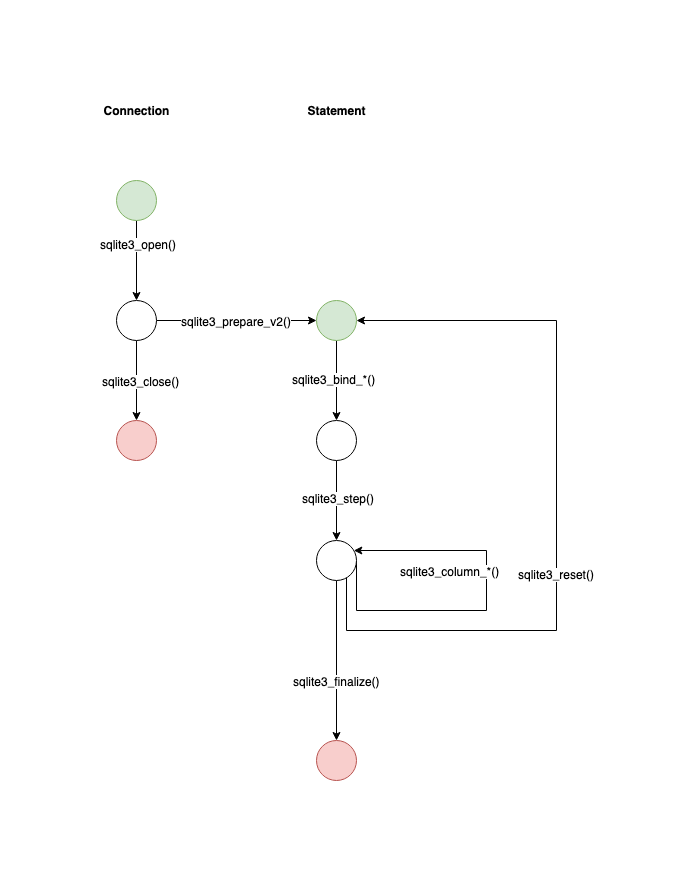
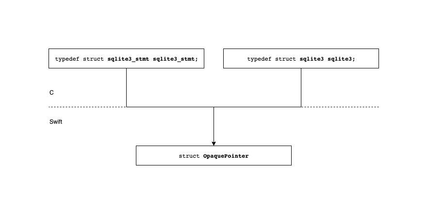
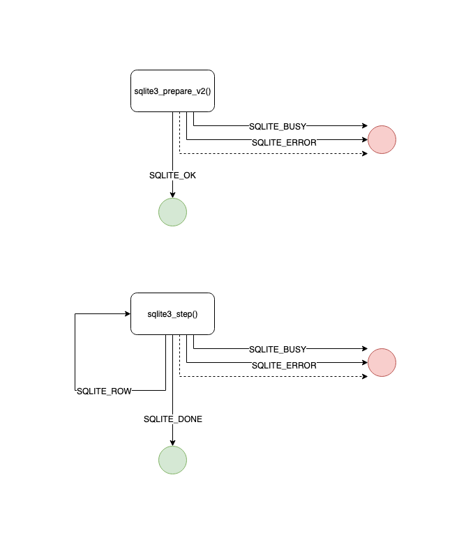

# Overall technical design

## SQLite API usage

This section explains how the SQLite API available on iOS works. First a general
overview is presented. Then we go into more details. At the end a complete code
example is presented.

### Overview

The first thing to do is open a connection. This is done with the 
`sqlite3_open()` function.

With a connection, we can compile queries and make statements with the 
`sqlite3_prepare_v2()` function.

Once we have a statement we can optionally bind values to query parameters with
the various `sqlite3_bind_*()` functions, choosing the one the matches the data
type.

Once values are bound we can execute the statement and read the first row of
results with the `sqlite3_step()` function.

When a row is available, we read the values using the `sqlite3_column_*()``
functions, choosing the one the matches the data type.

To read the next row, we call the `sqlite3_step()` function again and repeat until
all rows are read.

If we want to reuse the statement and run it again, we call the
`sqlite3_reset()` function, and then we can repeat the whole process of binding, 
stepping, and reading.

Once we are done with the statement, we destroy it with the `sqlite3_finalize()``
function.

When we are done with the connection, we close it and destroy the object with
the `sqlite3_close()` function.

The diagram below illustrates the steps.

### Data structures and types

Internally, the SQLite API has two main data structures:
- `sqlite3` represents a connection
- `sqlite3_stmt` represents a prepared statement

The bindings available on iOS do not expose those types nor an equivalent.
Instead they use objects of type `OpaquePointer` to wrap a C pointer to the
object.

### Return values and error handling

Most functions described above return a result code that indicates what
happened. Result codes are associated with constants available in the iOS
bindings.

When the operation was successful, most functions return `SQLITE_OK`.

The `sqlite3_step()` function returns `SQLITE_ROW` to indicate that a row has
been successfully read and that another row is available, and returns
`SQLITE_DONE` when there are no more rows to read.

Most functions can return various error codes like `SQLITE_BUSY`,
`SQLITE_MISUSE`, `SQLITE_ERROR`, or other codes.

