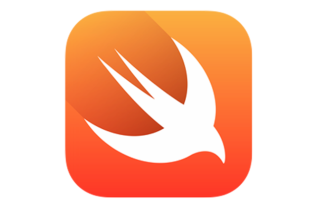

<p align="center">
  
  
</p>


#  SQLite.swiftly

*SQLite.swiftly* is a simple wrapper on top of the C-style SQLite APIs available
on Apple platforms written in Swift that provides type safe APIs to work with
SQLite databases, allowing as many compile time checks as possible, so you can
avoid many common mistakes before even running the code.

In short, *SQLite.swiftly*  makes writing incorrect code harder.


## Origins and features

*SQLite.swiftly* was originally part of the source code of the [My LEGO Collection](https://github.com/alexbinary/My-LEGO-Collection) project.
It has been moved into its own repository so it can have its own life, and why not inspire someone.

As such, development is driven by the needs of the [My LEGO Collection](https://github.com/alexbinary/My-LEGO-Collection) project,
and only features that are needed by that project are being developped.

Supported features:

- [x] create tables
- [x] insert into tables
- [x] select from tables (complete table dump, not suited for very large data sets)

Supported SQLite data types:

- [x] char
- [x] bool

*SQLite.swiftly* does not have proper error handling yet. Any error currently
triggers a `fatalError()`.


## Reference example

```swift
// 1. declare your database schema
//
// Here we describe a simple table named `contact` with one column `id` of type
// int and a column `name` of type varchar:

struct DemoDatabaseSchema {
  
  let contactTableDescription = ContactTableDescription()

  class ContactTableDescription: SQLite_TableDescription {
  
    let idColumnDescription = SQLite_ColumnDescription(
      
      name: "id",
      type: .int(size: 11),
      nullable: false
    )
    
    let nameColumnDescription = SQLite_ColumnDescription(
      
      name: "name",
      type: .char(size: 255),
      nullable: false
    )

    init() {
      
      super.init(name: "contact", columns: [
          
        idColumnDescription,
        nameColumnDescription,
      ])
    }
  }
}

// 2. Connect to the database

let connection = SQLite_Connection(toDatabaseAt: "path/to/db.sqlite")

// 3. Create the table

connection.createTable(describedBy: DemoDatabaseSchema.contactTableDescription)

// 4. Insert data into the table
//
// We first need to get prepared statement, then run it with the data:

let insertStatement = SQLite_InsertStatement(
  insertingIntoTable: DemoDatabaseSchema.contactTableDescription,
  connection: connection
)

insertStatement.insert([
  DemoDatabaseSchema.contactTableDescription.idColumnDescription: 1,
  DemoDatabaseSchema.contactTableDescription.nameColumnDescription: "John",
])

// 5. Read data

let rows = connection.readlAllRows(fromTable: DemoDatabaseSchema.contactTableDescription)
for row in rows {
  for (column, value) in row {
    print("\(column.name): \(String(describing: value))")
  }
}

// 6. Make sure resources are released
//
// Instances of SQLite_Connections and SQLite_Statement hold resources that need 
// to be released. Resources are released when the objects are deallocated, i.e. 
// when there are no more strong references to them. Statements keep a reference 
// to the connection that created them.
```


## Getting started

TODO


## Motivation and design

The SQLite C-style APIs make writing incorrect code way too easy.

Besides the fact that the SQLite C-style APIs require the use of low level and
not very swifty types such as `UnsafePointer` instead of `String`, connections
and statement are both manipulated through pointers of the same type
`OpaquePointer`, which makes it easy to make mistakes and pass one object when
you intended the other one.

By nature, a pointer can point to an uninitialized or destroyed object, and
there is no way to know if it points to a valid object at compile time. Keeping
track of what happens to the objects is on the programmer, and programmers
inevitably make mistakes.

On top of that, objects have an internal state machine, which the programmer
must keep track of in order to make the appropriate calls at the appropriate
time. Again, it is easy to make mistakes, and the compiler cannot help at all.
All the work is on the programmer, and errors are waiting at the corner.

Example:

```swift
// -- Open a connection

var connectionPointer: OpaquePointer!
sqlite3_open("path/to/db.sqlite", &connectionPointer)

// Easy, right ? but what if the connection failed ? sure we can check the
// status of the connection, but if we fail to do the proper checks nothing is 
// preventing us to use an invalid connection pointer.


// -- Compile an insert statement

var statementPointer: OpaquePointer!
sqlite3_prepare_v2(connectionPointer, "INSERT INTO table(c1, c2) VALUES(1,2"), -1, &statementPointer, nil)

// What if we mistakenly swap the connectionPointer and statementPointer ? we
// have to wait for the code to run, only to get an obscure and hard to debug 
// error. Come on we can do better!

// And what if we made a mistake in the SQL query ? again, we can check the 
// status of the statement but it is so easy to forget, and we should not have
// to do runtime checks on something we write in the code anyway.

// And also, what is that -1 doing ? and that `nil` at the end ?


// -- Release resources

sqlite3_finalize(statementPointer)

// So now we have to worry about the fact that anyone can destroy a statement
// without us knowing? Do we need to check if the object is still valid every
// time before we use it ? And what do we do if it is not ?

sqlite3_close(connectionPointer)

// Same problems with the connection.
```

*SQLite.swiftly* solves all these problems so you can focus on building your app 
instead of managing pointers and state machines.

The main design principles are:

1. Higher level objects encapsulate the underlying objects life cycle and expose
friendlier APIs.

2. You do not write SQL queries directly but instead describes the database
schema and lets *SQLite.swiftly* build the SQL queries for you.


### Higher level objects

These objects are `SQLite_Connection` and `SQLite_Statement` and its subclasses.
They all hold a pointer to the low level SQLite object.

These objects are immutable as much as possible. Connections are opened in 
`SQLite_Connection`'s initializer and closed in its deinitializer. Statements
are compiled in `SQLite_Statement`'s initializer and destroyed in its
deinitializer. This makes it impossible to use an invalid pointer.

From the programmer's point of view `SQLite_Connection` and `SQLite_Statement`
are stateless objects. Methods that mutate the underlying object always bring it
back to a default state before or after they do their work.

`SQLite_Connection` and `SQLite_Statement` expose features through simple APIs
that leverage all the goodness that Swift has to offer.


### Automatic SQL query generation

The best way to avoid writing bugs is to avoid writing the code all together.

*SQLite.swiftly* writes SQL queries so you don't have to. You provide type safe
descriptions of your database schema with tables and columns and let
*SQLite.swiftly* worry about writing correct SQL code.

This also has the benefit of having a single source of truth instead of
spreading the database structure in raw SQL queries that the compiler cannot
understand.


## Demo / Development project

TODO


