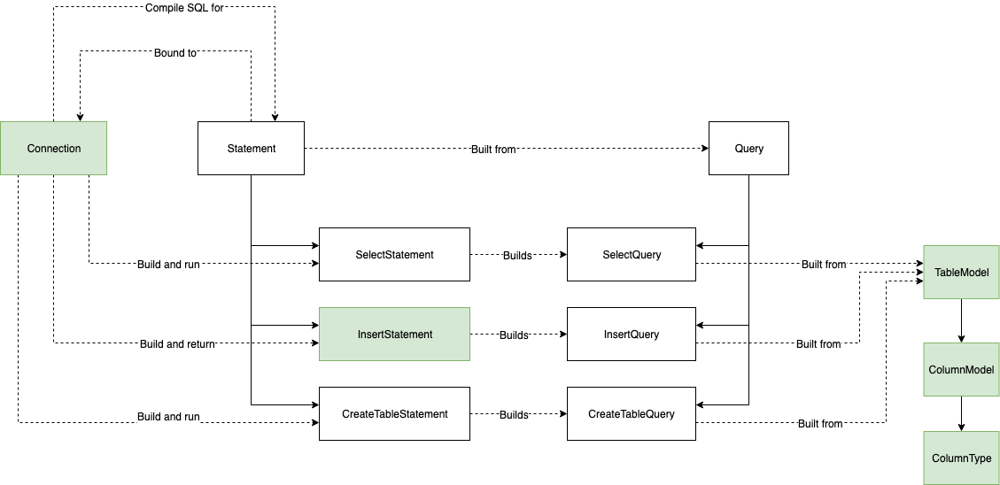
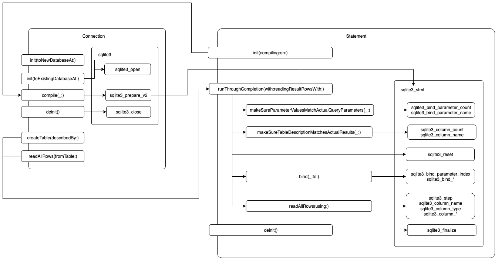

# Design notes

## Architectural diagram

This diagram shows how the various components of *SQLite.siwftly* fit together.

[SVG version](design.svg) - [Draw.io source file](design.drawio)

## Wrapping diagram

This diagram shows how the low level SQLite objects are wrapped by higher level
objects, namely `Connection` and `Statement`.

[SVG version](design_internal.svg) - [Draw.io source file](design_internal.drawio)

## General design considerations

### SQLite.swiftly is designed for the needs of the My LEGO Collection project

In My LEGO Collection we need to:

- create new SQLite databases
- create tables from a static schema
- insert large data sets into the tables efficiently
- open an existing SQLite database
- read all data from a table

As a result *SQLite.swiftly* implements only these features, and does so with
the goal of achieving the best performance.

Many features you would expect from a generic SQLite client are not implemented
in *SQLite.swiftly*.

## SQLite general design notes

To interract with a database, a SQLite client must first get a *connection handle*.
All subsequent operations use that handle.

Queries must *compiled* before they can be executed. Compiled queries are called
*prepared statements*.

The C-style API available on iOS uses pointers to manipulate the native SQLite
objects.

## General architecture design

### `Connection` and `Statement` encapsulate low level objects

`Connection` and `Statement` are the two main objects in *SQLite.swiftly*.

Each of them is a wrapper around the corresponding low level SQLite object, and
holds a reference to a pointer that points to that object.

`Connection` and `Statement` fully control the lifecycle and state machine of 
the low level object.

The pointer is fully private and cannot be accessed from outside the instance
of `Connection` or `Statement` that contain it, and `Connection` and `Statement`
are not designed to handle a change in the pointer or the object that happen 
outside of their control.

`Connection` and `Statement` create the low level object themselves in their
initializer. This guarantees that nobody has ever access to it and thus protects
from changes happening outside of their control.

From the user point of view, `Connection` and `Statement` are stateless: all 
public methods can be called at any time and in any order.

### Statements are linked to a connection

A statement holds a reference to the connection that was used to compile it.
The connection that was used to compile the statement is the connection on which
the statement executes when it is run.

Internally, the connection is used to access the error message if an error
occurs when the statement runs.

Accessing the connection from outside the `Statement` instance would be ok as 
there is nothing that a user can do to the connection that would make the 
statement invalid.

The reference to the connection is kept private until we see a relevant scenario
where one would need to access it.

### Low level statements objects are created by instances of `Connection`

Compiling a statement requires access to the low level connection object. As
that object is private to the `Connection` object, only the `Connection` object 
can compile a statement.

The `Connection` class provides an internal method that produces a low level
statement object from a Query object.

Statement objects call that method in their initializer to create the low level 
object they encapsulate.

The `Connection` class cannot directly produce an instance of Statement because 
it would have to inject the low level object into a `Statement` instance, which
is impossible by design (see above).

## Public API design

### Things are exposed for public use only if they need to be

Classes, structs, enums, protocols, methods and properties are exposed for
public use only if there is at least one approved scenario where a user would
need to use them.

By default, things are kept internal or private.

Making things public make them part of the public API, and thus requires that
they are maintained in future versions.

### Only insert statements are exposed for public use

Although internally various subclasses of `Statement` are used, almost 
everything can be achieved using convenience methods on the Connection class.

Thus, `Statement` and most of its subclasses do not need to be exposed for 
public use.

Inserting data is the only operation that requires explicit use of `Statement`
object (by design, see below), and thus only the corresponding subclass of 
`Statement` needs to be exposed for public use.

### Naming communicates clearly what things are and are not

The classes used to communicate the structure of tables and columns are called
`TableDescription` and `ColumnDescription` and not just `Table` and `Column` to
avoid confusing those object with actual tables and columns.

If those object were actual tables and columns, one could expect methods like
`Table.drop()`, and would be confused if they could not find those methods.

Using names that communicate that those are just models helps prevent this.

### `Connection` intializers make assumptions explicit

The native SQLite function creates a new database when you try to connect to a
database that does not exist. This is convenient but can lead to confusion.

Indeed, most of the time you want to either create a new database or connect to
an existing database, and you *know* which one you want.

If you want to create a new database then you want to be alerted if a database
already exists in the location you specified, as this means your assumption that
you need to create the database is wrong.

Similarily, if you want to connect to an existing database then you want to be
alerted if the database does not exist, as this means your assumption that it
did is wrong.

When you request a connection to a database, *SQLite.swiftly* asks you to 
express whether you expect the database to exist or not. If you expect the 
database to exist and it does not, then a runtime error is raised. Same if you 
expect the database to not exist and it does.

This helps catch situations where you think you are doing one thing but you are
actually doing something else you did not intend.

### `Connection` offers convenience methods

`Connection` offers conveniance methods to execute simple queries on the
connection without having to create a statement explicitly. The method creates 
the statement for you and executes it immediately.

The following convenience methods exist:
- create a table from a table model
- prepare an insert statement
- read all rows from a table

### Inserts use explicit prepared statement

Insert statements insert one row at a time. Although there are ways to insert
multiple rows in one single `INSERT INTO` query, inserting only one row allows
a much simpler design. Using prepared statements mitigates the possible
performance loss.

To insert data into a table, the user must explicitly request a prepared
statement, then use it to insert data. 

This helps achieve good performances when inserting large amount of data as it
encourages the use of one prepared statement to insert many rows.

Having a convenience method on the connection that compiles a statement and
inserts a single row would make it too easy for the user to inadvertantly
compile a new statement for each row they insert.

`SELECT` and `CREATE TABLE` statements are not usually run multiple times with
varying data, so compiling a new statement each time is not an issue. That is
why there are convenience methods for that.

## Internal design

### SQL queries never transit as strings

Whenever a SQL query is expected, use an instance of a type that conforms to the
`SQLQuery` protocol. Passing SQL queries as strings should be avoided at all
costs as this provides no guarantee that the string contains a valid SQL query.

### A table model has a set of columns, not an array

Using a set guarantees that prevents a table model from having two identical
columns.

Plus, the order of the columns in a table is not important, and although columns
do have an order in the table, using column names is safer than using positions.

### `Statement` has one general purpose non-private method

`Statement` has only one public method besides the initializer. This method
triggers the execution of the statement and returns the result rows, if any.

The method takes a list of parameters that get bound to the statement.
Parameters are verified against the actual query to make sure that all
parameters are given a value.

The method takes a table model that is used to read the raw data in the
appropriate format and present the output data. The model is verified against
the actual data to make sure that they match.

If the parameters or the table model do not match the actual query, a runtime
error is triggered to help the programmer detect mistakes.

The underlying state machine is reset on each execution so that the method can
be called multiple times with different parameters.

## Error handling

### Error handling is minimal

Until *SQLite.swiftly* becomes more stable, error handling will recieve only as
much attention as is absolutely required.

For now, error handling is mostly useful to the programmer and should be
designed to help identify design errors or external constraints that need to be
addressed in the design.

Proper error handling intented for the user is planned once the project becomes
stable enough.

Only the main code path is considered. Alternative code paths are not considered
at all and any detectable divergence from the main path triggers an error.

Only one, generic type of error is used. The error carries a custom message
designed to help the programmer identify what went wrong.

### Error handling uses conventional swift strategy

Methods that can fail can throw enum values that conform to the swift `Error`
protocol.

It is up to the user to handle the error in any way they want.

Using `fatalError()` as was initially the case, although simple and convenient,
is not testable. Throwable functions are testable.

### `Connection` provides internal access to the latest error message

When errors occur on a connection, the latest error message is stored and can
be access with a simple function. If no error has occured yet, the error message
says `not an error`.

`Connection` offers a high level way to access the latest error message, with the
added benefit of a clearly identified "no error" case. When the error is `not an
error`, `Connection` returns `nil` instead.

The error message is not intended to be used publicly by client code, as it is
part of the implementation details. It is however usefull to other classes that
are related to a connection, namely statements. Statements log the connection's
error message when they detect an error during their execution.

### SQLite errors are not detected using the error message

The latest error message provided by the SQLite engine is used only to provide
additionnal information when errors are detected. It is not used to check
whether an error occured or not.

Errors triggered by SQLite functions are detected using the return value of
those functions when they have one.
